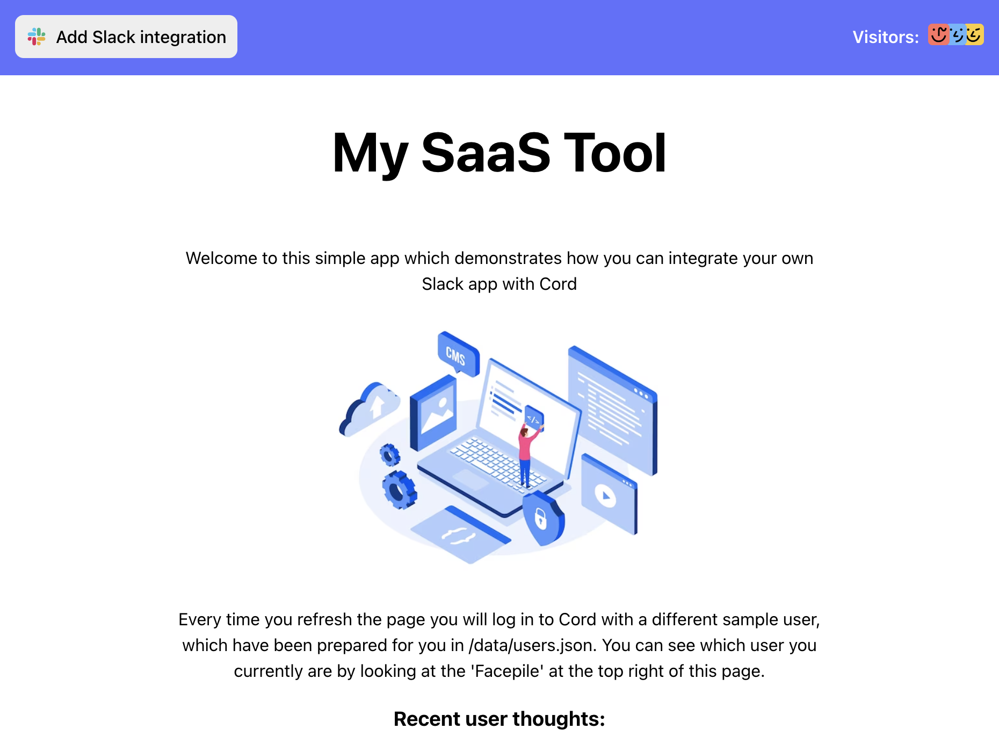

# Cord x Slack Demo 

This repository contains a demo app - My SaaS Tool - and a server which demonstrates
how you can integrate Cord with Slack app functionality.

<p align="center">

</p>

## What does the integration do?
You can customize your Slack app to integrate with Cord however you please.  Depending
on your product needs, you will probably prefer to do some things differently 
from how they are done in this app.

The main things this app shows are:
* Associating Slack users with your (Cord) users - so you know where to send notifications 
* Notifying users on Slack when a new message that is relevant to them is sent on Cord
* How to share a thread from Cord to Slack, and mirror any subsequent messages from either side

## Setup Overview:
1. [Set up a Slack app](#slack-app-setup)
2. [Create .env](#env-setup)
3. `npm i`
4. Run `./scripts/generate-localhost-cert.sh` to generate https certificates for localhost
5. Start the app and server together with `npm run start`
6. [Set up ngrok](#set-up-ngrok) (or your own deployment for connections with Slack and Cord servers)
7. Visit https://localhost:3000/ to interact with the app!

### Slack App Setup
First things first, you will need to create a Slack app to play with, if you don't
have one already!  You can do this at https://api.slack.com/apps, choosing 
'Create new app'.  We suggest you create it 'From scratch', using Slack's UI.

You can design your Slack integration to your requirements.  For the full functionality
of this demo app to work, you will need to choose the following token scopes in 
the OAuth & Permissions tab:
```
channels:history
channels:join
channels:read
chat:write
im:read
im:write
users:read
users:read.email
```

You will also need to enable events on the Event Subscriptions tab, and subscribe
to `message.channels` events.

You will need to set up a redirect URL and an events URL - more explanation on 
this below in the "Set up ngrok" section, if needed.

### .env Setup

To get this repo up and running, you will need to create a file called .env in the 
root and add the following variables:
```
SLACK_APP_CLIENT_SECRET=<CLIENT_SECRET>
SLACK_APP_CLIENT_ID=<CLIENT_ID>
SLACK_APP_SIGNING_SECRET=<SIGNING_SECRET>
CORD_SIGNING_SECRET=<SECRET>
CORD_APP_ID=<APP_ID>
```

#### Slack Variables
The Slack variables relate to a Slack app created by you, which can be done at
https://api.slack.com/apps/

Once you have set up your app, the relevant fields are on the 'Published App
Settings' page at a URL like `https://api.slack.com/apps/{YOUR-SLACK-APP-ID}/published-settings`

#### Cord Variables
To get the Cord variables you will need to create a Cord application at https://console.cord.com
The values you need can be found there on the 'General' tab.


### Set up ngrok
This step is needed so that Cord's and Slack's servers can speak to your locally 
running app, specifically for:
* The Slack Oauth redirect process, so you can auth the Slack app integration to 
the app locally
* Receiving Slack webhook events
* Receiving Cord webhook

You will need to have the ngrok agent installed, e.g. by running
`brew install ngrok/ngrok/ngrok`
See https://ngrok.com/docs/getting-started/ for more options

Set up an ngrok account and add your token to your local config by running:
`ngrok config add-authtoken <YOUR-TOKEN>`

Start ngrok and point it to the app's server by running: 
`ngrok http https://localhost:3001`

In your terminal window you should see some ngrok logs, including a line like
`Forwarding https://0000-00-0-000-000.ngrok-free.app -> https://localhost:3001`
(with a collection of different numbers, not all 0s)

You will need to add the ngrok-free domain to 3 places with 3 paths:
1. `/auth`
Your Slack app Oauth redirect URL, which is done at https://api.slack.com/apps/{YOUR-SLACK-APP-ID}/oauth
This should look like `https://0000-00-0-000-000.ngrok-free.app/auth`

2. `/slackEvents`
Your Slack app events webhook URL, which is done at https://api.slack.com/apps/{YOUR-SLACK-APP-ID}/event-subscriptions
This should look like `https://0000-00-0-000-000.ngrok-free.app/slackEvents`

3. `/cordEvents`
Your Cord app events webhook URL, which is done at https://console.cord.com/applications/{YOUR-CORD-APP-ID}/events
This should look like `https://0000-00-0-000-000.ngrok-free.app/cordEvents`

NB if you are using the free tier of ngrok you will have to update these links
every time you stop and restart the ngrok process, as it will generate a link
with a different subdomain each time
